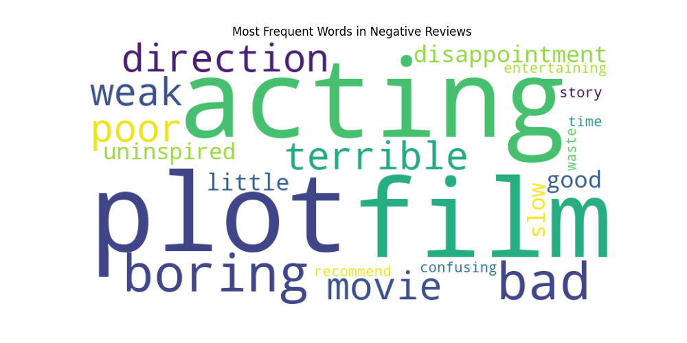
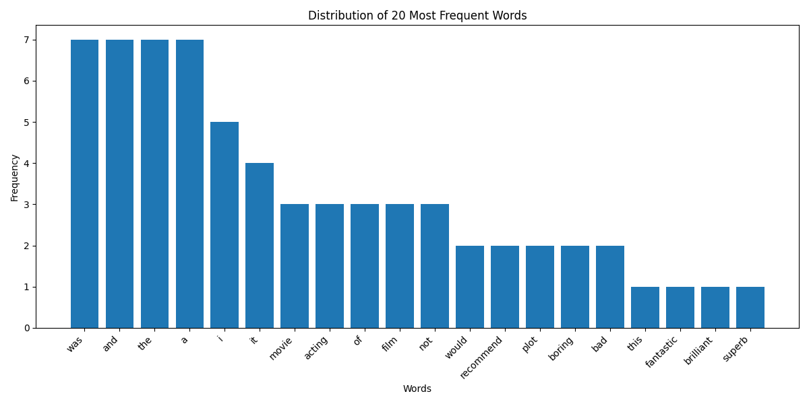

# Sentiment Analysis on Movie Reviews

## Overview

This project demonstrates how to build a text classifier using the Naive Bayes algorithm to perform sentiment analysis on movie reviews. The objective is to classify a given review as either "positive" or "negative." This project is a great introduction to natural language processing (NLP) and text classification.

## Features

- Data Preprocessing: Cleans text data by converting it to lowercase and removing punctuation.

- Vectorization: Transforms text reviews into a numerical format using the Bag-of-Words model (specifically, TF-IDF).

- Model Training: Trains a Multinomial Naive Bayes classifier, which is well-suited for discrete data like word counts.

- Hyperparameter Tuning: Optimizes the model's performance by tuning the alpha smoothing parameter using GridSearchCV.

- Performance Evaluation: Provides a detailed classification report with key metrics like precision, recall, and F1-score.

- Visualization: Generates informative visualizations, including word clouds and word distribution plots.

## Technologies Used

- Python: The core programming language.

- NumPy: For numerical operations.

- scikit-learn: The primary machine learning library for building the classifier and handling data processing.

- Matplotlib: For creating bar charts and other plots.

- WordCloud: A dedicated library for generating word cloud visualizations.

## Data Analysis & Processing

For this project, a small, hard-coded dataset of movie reviews is used to make the code immediately runnable. For a real-world application, you would replace this with a larger dataset like the IMDB movie review dataset. The text is preprocessed by removing punctuation and converting it to lowercase. Then, the TfidfVectorizer from scikit-learn is used to transform the text into a numerical matrix, representing the importance of each word in a document.

## Model Used

The core model is a Multinomial Naive Bayes classifier. This algorithm is based on Bayes' Theorem and a "naive" assumption of feature independence. It is particularly effective for text classification problems where the features are word frequencies or TF-IDF values.

## Model Training

The data is split into training and testing sets. A Pipeline is used to chain the TfidfVectorizer and the MultinomialNB model. The GridSearchCV method is then applied to the pipeline to search for the optimal alpha parameter for the Naive Bayes model. The model is trained on the training data and evaluated on the unseen testing data.

## How to Run the Project

1. Clone the repository:

```bash
git clone <https://github.com/sjain2580/Sentiment-Analysis-with-Naive-Bayes>
cd <repository_name>
```

2. Create and activate a virtual environment (optional but recommended):python -m venv venv

- On Windows:
  
```bash
.\venv\Scripts\activate
```

- On macOS/Linux:

```bash
source venv/bin/activate
```

3. Install the required libraries:

```bash
pip install -r requirements.txt
```

4. Run the Script:

```bash
python sentiment_analysis.py
```

## Visualization

The project generates two types of visualizations:

- Word Clouds: Word clouds are created for both "positive" and "negative" reviews to visually represent the most frequently occurring words in each class.

- Distribution Plot: A bar plot is generated to show the frequency of the most common words across the entire dataset, providing insight into the overall vocabulary.


## Contributors

**<https://github.com/sjain2580>**
Feel free to fork this repository, submit issues, or pull requests to improve the project. Suggestions for model enhancement or additional visualizations are welcome!

## Connect with Me

Feel free to reach out if you have any questions or just want to connect!
**[](https://www.linkedin.com/in/sjain04/)**
**[](https://github.com/sjain2580)**
**[](mailto:sjain040395@gmail.com)**

---
